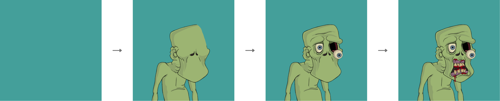

# Art

The zombies were people before their infection. Therefore they have names and genders. The names in the collection are unique, like all tokens. You can easily reference your token by zombie name.
