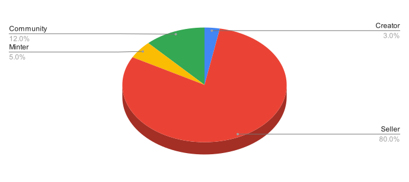

# Marketplace

Burning Zombies have an internal marketplace that will open after the mint and burning process. The marketplace has a reflection system; the minter, community, and creator will receive a particular share from each sale. Burning Zombies' marketplace rules all! **We highly recommend using the internal market.**

In the custom marketplace, **the first minters of the token earn 5%, the creator 3% royalties** each time the token is resold, and **12% of each sale is redistributed to the community.**
