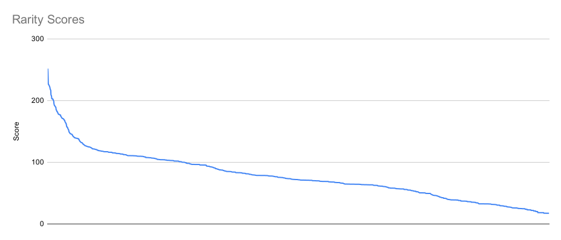

# Rarity

Token rarities come from the accessories assigned to tokens. All accessories used a certain ratio in the whole collection and were set scores by their amount. The token which has the highest score is the rarest and valuable one. The owner mints ten rare tokens for future marketing purposes.

## Calculation of the Scores

The calculation refers to the average rarity of the trait, and the token rarity is the sum of trait scores.

= trait score

= trait amount in the collection (revealed)

= total supply

## Calculation of the Rarity Labels

Rarity labels founded by tokens overall rarity;

:star:** Common:** The zombies which have a score between .svg>) and .svg>)

:star:** Uncommon:** The zombies which have a score between  and 

:star:** Rare:** The zombies which have a score between .svg>) and .svg>)

:star:** Super Rare:** The zombies which have a score between .svg>) and 

:star:** Mystic:** The zombies which have a score between  and 

:star:** Legendary:** The zombies which have a score between .svg>) and 

Accessories are distributed to tokens fairly. All tokens are unique, and some are rare; as seen above, **\~20% of tokens are rarer than the rest of the collection.** Rarity scores will be visible after the burning process.
